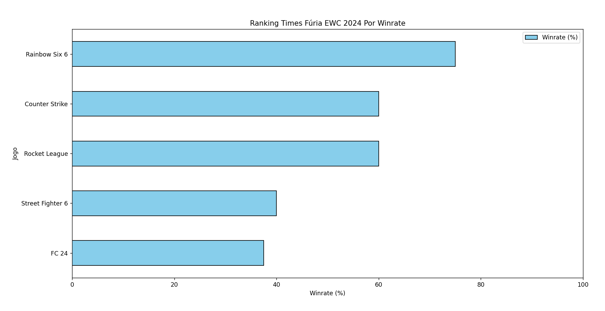

# 🎯 Desafio EWC

O **Desafio EWC** tem como premissa criar um ranking do desempenho da equipe Fúria na Esports World Cup 2024. 🚀 Para isso, era necessário que fosse feita uma coleta automática dos resultados da equipe em todas as modalidades que disputou! 🌐 (Stack livre).

## 🔍 Como foi feita a Coleta de Dados?

- **Web Scraping** 🕷️
  - A coleta de todos os dados das partidas da Fúria no campeonato foi realizada através de web scraping.
  - Foi utilizada a página do campeonato na [Liquipedia](https://liquipedia.net/esports/Esports_World_Cup/2024) para obter todos os resultados necessário de todas as etapas.
  - O projeto foi desenvolvido de maneira que fazendo apenas algumas alterações seja possível gerar o ranking de qualquer equipe! ⚙️

- **Por que não usar uma API?** 🤔
  - Muitas APIs disponíveis não cobrem todas as modalidades em que a Fúria participou.
  - Além disso, APIs gratuitas possuem limites de requisições e menos detalhes sobre as partidas. 🚫

## 📂 Estrutura do Projeto

- **`/case_ewc`**: Onde ocorre a execução do projeto.
  - **`/ingestion`**: Scripts para coleta de dados via web scraping.
    - **`/games`**: Scripts específicos para cada jogo.
  - **`/processing`**: Processamento dos dados e criação de gráficos.
- **`/data`**: Armazena os resultados das partidas e rankings em formato JSON.
- **`/tests`**: Diretório designado para testes unitários.
- **`/utils`**: Contém constantes e métodos comuns usados no projeto.

## 🛠️ Requisitos

- Python (versão 3.8 ou superior) 🐍
- Dependências listadas em **pyproject.toml** 📜

### 📥 Instalação

1. Clone o repositório:

   ```
   git clone https://github.com/rafaeltiribas/ewc-desafio
   cd ewc-desafio
   ```

2. Instale as dependências:

   ```
   pip install .
   ```

3. Entre no diretório de execução:

   ```
   cd case_ewc
   ```

4. Rode o projeto:

   ```
   python main.go
   ```

## 🚀 Execução

- **Resultados da Fúria**: Todos os resultados das partidas estão no arquivo **furia_matches.json** dentro do diretório `data`. Confira os resultados da Fúria!
- **Ranking**: O ranking da Fúria é gerado e salvo em **furia_ranking.json**, com o desempenho em cada modalidade.
- **Gráfico**: Um gráfico visualizando os dados obtidos será exibido na tela para facilitar a análise.

## 📊 Resultado

<p align="center">
  
</p>

## 📧 Contato

Para qualquer dúvida ou feedback, entre em contato comigo por [rafaeltiribas@outlook.com](mailto:rafaeltiribas@outlook.com).
